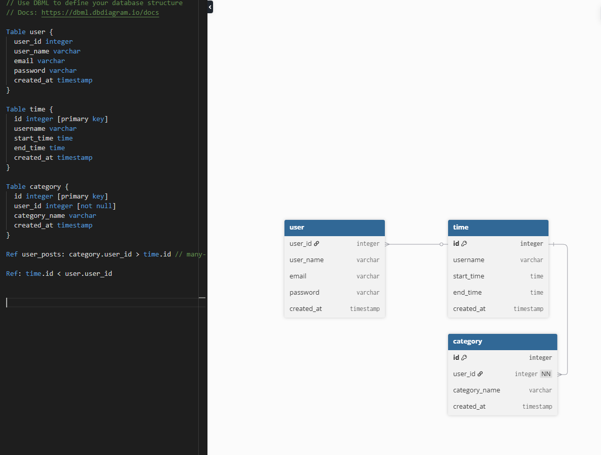

*Ideas*
1. Add additional section with task list
2. Add additional section with linux excercises
3. Add points 

*Data in DB*

1. User - name, email, password, rights - automatically created by django
2. TimeModel
   1. StartTime
   2. EndTime
   3. DurationTime
   4. User()
   5. 
3. ScoreModel
    1. User()
    2. Points
